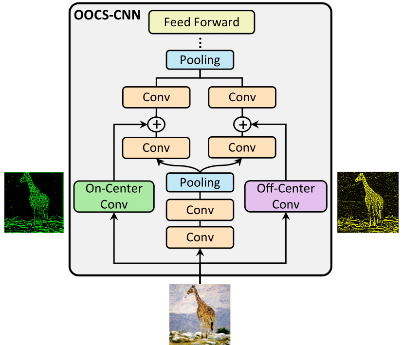

# On-Off Center-Surround Receptive Fields for Accurate and Robust Image Classification


<p align="center">
  
</p>
## Requirements

**Packages**
- Python 3.6 or newer
- TensorFlow 2.0 or newer

Tested with python3.8.5/python3.6 and TensorFlow 2.2 on Ubuntu 18.04

## Data preparation

Data for the Imagenet subset and small Norb datasets must be downloaded first. The MNIST dataset is loaded through the ```tf.keras.datasets``` API.
Data download can be done by 

```bash
source data_download.sh
```


## Module description

- ```Compute_Kernels.py```: Implementation of computation of our proposed OOCS kernels, and SM kernels introduced in paper "surround modulation: a bio-inspired connectivity structure for convolutional neural networks"
- ```experiments``` : This folder contains the codes for each of the experiments separated by folders. Each of the four executable python scripts contain the code for loading and pre-processing the data, as well the code to train and evaluate the models.

## Example usage

The executable python scripts use some command line argument parsing to specify the network variant and hyperparameters.
The network variant can be specified by ```--model CNN```, where ```CNN``` is the model name. 

For instance

```bash
python3 experiments/ImageClassification/ImageClassification_train.py --model Basenet0 --epochs 25 --lr 0.0001
```

runs the Imagenet subset classification experiment with the Basenet0 model.

## Logging

Each executable python script stores the result of the experiment in the directory ```experiments/results``` (which will be created if it does not exists).
The ```results``` directory will have the following structure:

- ```results/ImageClassification``` Results of the Imagenet subset classification task
- ```results/Robustness_Norb``` Results of the robustness evaluations experiments on Norb
- ```results/Robustness_MNIST``` Results of robustness evaluation experiment on MNIST


The results for different network variants will be logged in separate files.

## Citation

```bibtex

@InProceedings{pmlr-v139-babaiee21a,
  title = 	 {On-Off Center-Surround Receptive Fields for Accurate and Robust Image Classification},
  author =       {Babaiee, Zahra and Hasani, Ramin and Lechner, Mathias and Rus, Daniela and Grosu, Radu},
  booktitle = 	 {Proceedings of the 38th International Conference on Machine Learning},
  pages = 	 {478--489},
  year = 	 {2021},
  editor = 	 {Meila, Marina and Zhang, Tong},
  volume = 	 {139},
  series = 	 {Proceedings of Machine Learning Research},
  month = 	 {18--24 Jul},
  publisher =    {PMLR},
  pdf = 	 {http://proceedings.mlr.press/v139/babaiee21a/babaiee21a.pdf},
  url = 	 {http://proceedings.mlr.press/v139/babaiee21a.html},
}
```